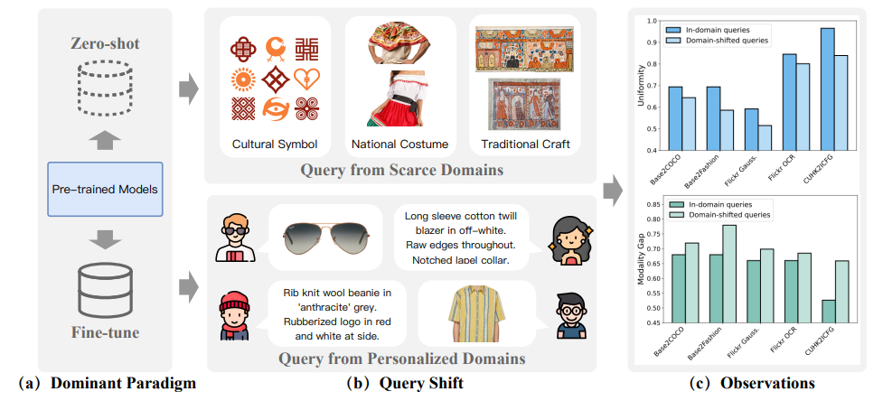
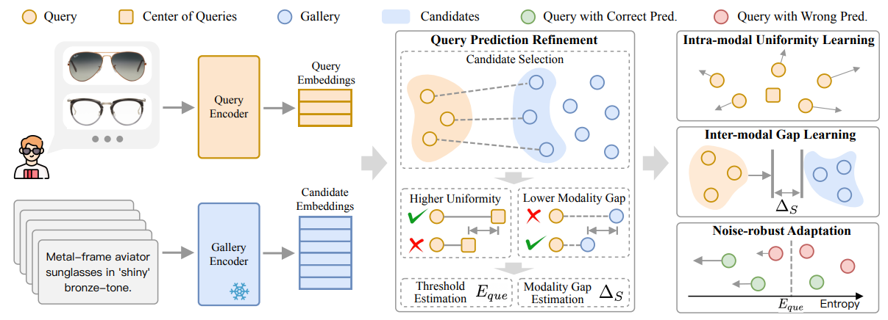
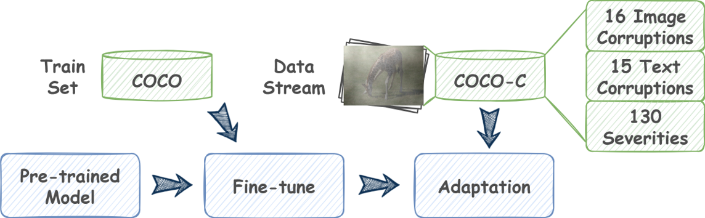
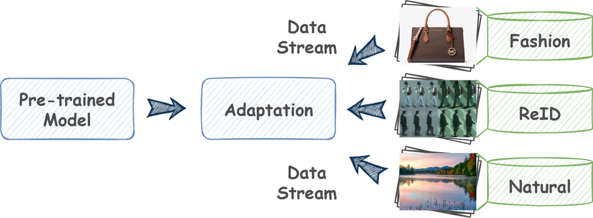

## Test-time Adaptation for Cross-modal Retrieval with Query Shift

[](https://hbinli.github.io/TCR/)
[](https://arxiv.org/abs/2410.15624)
[](https://mp.weixin.qq.com/s/w3mp7j6_7ZIfcmNFAUJDRA)

## What's New 🚀 (2025.11)

- We extend the definition of **query shift** and tackle more challenging **multi-distribution shift** and **diverse shift scenarios** across a broader spectrum of cross-modal retrieval tasks, including **video–audio retrieval** and **composed image retrieval**.

> Haobin Li, Mouxing Yang, Xi Peng, Toward Robust and Harmonious Adaptation for
Cross-modal Retrieval, Arxiv. 👉 [[paper]](https://arxiv.org/abs/2511.14416) 
  
## Definition

**Query shift** refers to the online query stream originating from the domain that follows a different distribution with the source one. TCR (Test-time adaptation for Cross-modal Retrieval) aims to reconcile **query shift** challenge in the cross-modal setting. 

> Haobin Li, Peng Hu, Qianjun Zhang, Xi Peng, Xiting Liu, Mouxing Yang, Test-time Adaptation for Cross-modal Retrieval with Query Shift, ICLR 2025 (Spotlight).  👉 [[paper]](https://openreview.net/pdf?id=BmG88rONaU) 

## Background



Cross-modal retrieval aims to associate relevant samples from a gallery set across different modalities. Recently, pre-trained models have emerged as the dominant approach for this task. These models leverage generic knowledge from the source domain to perform **zero-shot** retrieval in target domains or can be **fine-tune**d on domain-specific data for customization. 

However, their success heavily relies on the assumption that the given queries exactly follow the same distribution from the source domain. Clearly, such out-of-domain queries violate the identical distribution assumption and thus lead to the **query shift** problem. As a result, the existing cross-modal retrieval models fail to handle the query shift and inevitably suffer from significant performance degradation

## Method

TCR employs a novel module to refine the query predictions (namely, retrieval results of the query) and a joint objective to prevent query shift from disturbing the common space, thus achieving online adaptation for the cross-modal retrieval models with query shift. 



## Benchmarks

To investigate the influence of cross-modal retrieval with query shift, we employ the following two settings for extensive evaluations: 

- **Query Shift (QS)**: In this setting, only the queries come from different distributions with the source-domain data. Following [this repository](https://github.com/Jielin-Qiu/MM_Robustness), we introduce 16 types of corruptions to the image modality and 15 types to the text modality across widely-used image-text retrieval datasets, COCO and Flickr. As a result, the **COCO-C** and **Flickr-C** benchmarks are constructed, which would result in distribution shifts on either the image or text modalities.



- **Query-Gallery Shift (QGS)**: In this setting, both the query and gallery samples are drawn from distributions different from the source-domain data. To this end, evaluations are directly conducted on the pre-trained model upon several widely-used image-text retrieval datasets from various domains, including Fashion-Gen from the e-commerce domain, **CUHK-PEDES** and **ICFG-PEDES** from the person re-identification (ReID) domain, and **COCO**, Flickr, and **Nocaps** from the natural image domain.



We provide two evaluation settings for the query shift challenge. You can download the benchmarks via [Google Cloud](https://drive.google.com/drive/folders/17QyJ9Y52XB67jektNvhUk6jKmIQnoatF?usp=sharing) or [Baidu Clound](https://pan.baidu.com/s/1Roulr_VPLJ7kr4eHwjrpJA?pwd=abcd) (Passwd: abcd).

Here we provide more details abouth how to get Flickr-C and COCO-C benchmarks in [this repository](https://github.com/Jielin-Qiu/MM_Robustness). Specifically, for image corruptions, we employ `image_perturbation/perturb_COCO_IP.py` to construct image corruptions for the COCO dataset and `image_perturbation/perturb_Flickr30K_IP.py` for the Flickr dataset. For text corruptions, we utilize `text_perturbation/perturb_COCO_TP.py` to construct text corruptions for the COCO dataset and `text_perturbation/perturb_Flickr30K_TP.py` for the Flickr dataset.

## Get Started

### File Organization

```
├── data
│   ├── coco_dataset.py           # dataloaders
│   ├── ...
│   └── utils.py
├── configs
│   ├── QS                     # Config files for QS setting
│   ├── QGS                    # Config files for QGS setting
│   └── Reid                   # Config files for Reid (QGS) setting
├── dataset
│   ├── coco				 # coco dataset
│   ├── coco-IP				 # coco dataset with image corruptions
│   │   ├── COCO_IP_brightness_1
│   │   ├── ...
│   ├── coco-TP				 # coco dataset with text corruptions
│   │   ├── annotation_OcrAug
│   │   ├── ...
│   ├── ...
│   └── Fashion-Gen
├── model
│   ├── tta_baselines
│   │   ├── tcr.py			 # method
│   │   ├── read.py			 
│   │   ├── sar.py			 
│   │   ├── tent.py
│   │   ├── ...
│   └── blip_tta.py			 # model
├── output                    # output log
├── weights                   # pretrained model weight
│   ├── blip
│   ├── fashion_pretrained
│   └── reid
└── main.py	
	demo script for evaluating TCR
```

### Pretrained Model

The proposed TCR supports mainstream pre-trained models, including BLIP and CLIP.

- **BLIP** can be downloaded from [BLIP](https://github.com/salesforce/BLIP).
- **CLIP** can be accessed via [Hugging Face OpenAI](https://huggingface.co/openai).

In our implementation, the CLIP model can be directly downloaded through the code. For other models, we provide additional download links [Google Cloud](https://drive.google.com/drive/folders/1tVuNY9l520BY6SvDdzzmNhF_wCrIaUei?usp=sharing) or [Baidu Clound](https://pan.baidu.com/s/1iqkjFROQeXcFO1zZsKILEg?pwd=abcd) (Passwd: abcd).

### Reproduce

To run the **TTA process**, use the following commands:

#### Text Retrieval

- **BLIP Base & CLIP**

  ```bash
  CUDA_VISIBLE_DEVICES=0,1 python -m torch.distributed.run --nproc_per_node 2 --master_port 10000 main.py --retrieval i2t --config your-config-path --method tcr
  ```

- **BLIP Large**

  ```bash
  CUDA_VISIBLE_DEVICES=0,1,2,3 python -m torch.distributed.run --nproc_per_node 4 --master_port 10000 main.py --retrieval i2t --config your-config-path --method tcr
  ```

#### Image Retrieval

  ```bash
  CUDA_VISIBLE_DEVICES=0 python -m torch.distributed.run --nproc_per_node 1 --master_port 10000 main.py --retrieval t2i --config your-config-path --method tcr
  ```

#### Parameter

- **`--method`**: You can choose from existing baselines for evaluation or reproduce other methods directly in `./model/tta_baselines/`. Below are some provided SOTA baselines:  
  - **Tent** ([GitHub](https://github.com/DequanWang/tent))
  
  - **SAR** ([GitHub](https://github.com/mr-eggplant/SAR))

  - **READ** ([GitHub](https://github.com/XLearning-SCU/2024-ICLR-READ))
  
  - To use TCR, set `--method tcr`; To use Tent, set `--method tent`.

- **`--retrieval`**:
  - `i2t`: Image-to-text retrieval
  - `t2i`: Text-to-image retrieval
  - `None`: Disables TTA

## Citation

If this codebase is useful for your work, please cite the following papers:

```BibTeX
@inproceedings{li2025test,
    title={Test-time Adaptation for Cross-modal Retrieval with Query Shift},
    author={Haobin Li, Peng Hu, Qianjun Zhang, Xi Peng, Xiting Liu, Mouxing Yang},
    booktitle={International Conference on Learning Representations},
    year={2025}
    }
```

## Acknowledgements
The code is based on [MM_Robustness](https://github.com/Jielin-Qiu/MM_Robustness) and [BLIP](https://github.com/salesforce/BLIP) licensed under Apache 2.0.
